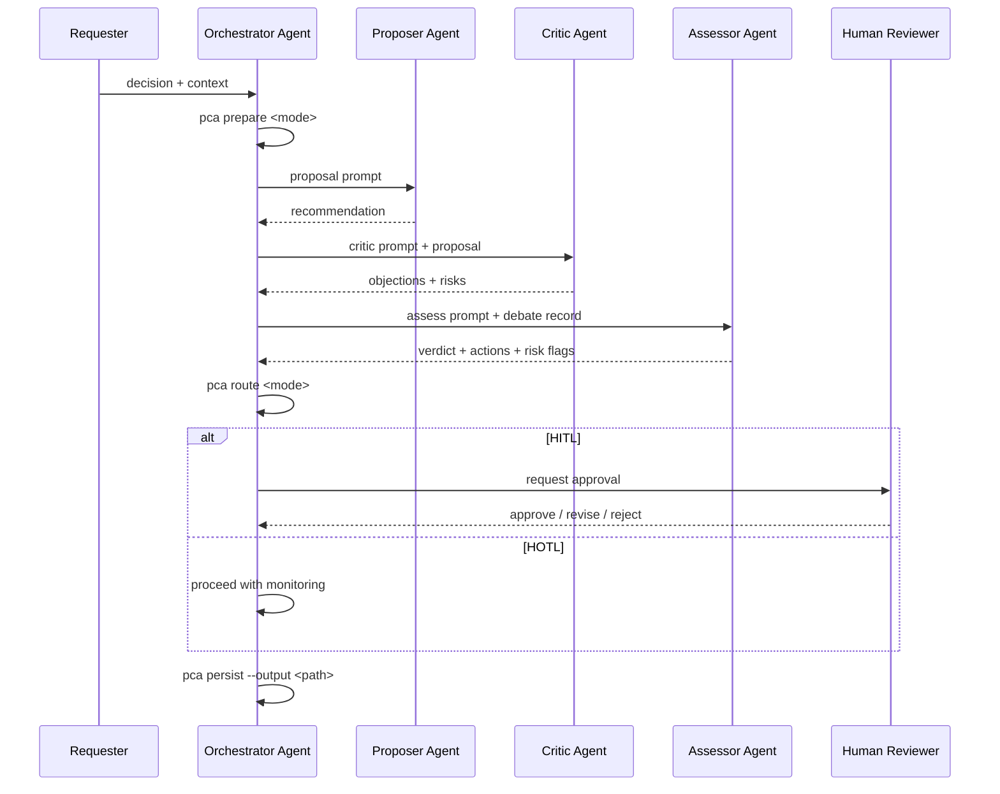

# PCA

PCA (Propose-Critique-Assess) is a standalone quality workflow engine inspired by GSD standards.

It applies structured debate, quality checks, and explicit governance (`HITL`/`HOTL`) to improve decision quality before execution.

```text
██████╗   ██████╗    █████╗
██╔══██╗ ██╔════╝   ██╔══██╗
██████╔╝ ██║        ███████║
██╔═══╝  ██║        ██╔══██║
██║      ╚██████╗   ██║  ██║
╚═╝       ╚═════╝   ╚═╝  ╚═╝
```

## Why PCA

- Independent workflow: use PCA in any project or stack.
- Quality-first: force assumptions and risks into the open.
- Traceable outputs: verdict + actions + risk flags.
- Governance-ready: clear routing to `HITL` or `HOTL`.

## Workflow Diagram



## Role and Agent Showcase

| Role | Typical Owner | Responsibility |
|---|---|---|
| Requester | Human | Provides decision and context |
| Orchestrator | AI agent or automation | Runs CLI commands and coordinates flow |
| Proposer | AI agent | Produces recommendation and assumptions |
| Critic | AI agent | Challenges recommendation and exposes risk |
| Assessor | AI agent | Produces verdict and required actions |
| Human Reviewer | Human | Final authority for HITL escalations |

Detailed workflow, swimlanes, and agent topology: `docs/WORKFLOW.md`

## Installation

### Local dev usage

```bash
npm install
node bin/pca.js prepare discuss --decision "API strategy" --context "Migrate safely"
```

### Optional global CLI usage

```bash
npm install -g .
pca prepare discuss --decision "Architecture framing" --context "Phase 1 migration"
```

## Command Reference

| Command | Purpose | Output |
|---|---|---|
| `pca prepare <discuss|verify>` | Build PCA session contract (framework + prompts) | JSON session object |
| `pca run <discuss|verify>` | Current alias of `prepare` for standalone MVP | JSON session object |
| `pca route <discuss|verify>` | Compute governance routing from verdict/risk | JSON with `human_control` |
| `pca assess <discuss|verify>` | Build final PCA assessment payload | JSON assessment object |
| `pca persist <discuss|verify>` | Save assessment output to disk | JSON receipt + saved file |
| `pca help` | Show CLI usage and examples | Plain text reference |

Detailed per-command reference: `docs/COMMAND-REFERENCE.md`

## Example Commands

```bash
# Discuss framing
node bin/pca.js prepare discuss --decision "service boundary" --context "latency and ownership"

# Verify risk routing
node bin/pca.js route verify --verdict "accepted-with-conditions" --risk-flags "partial coverage"

# Build final assessment payload
node bin/pca.js assess verify --verdict "accepted" --judgement "Evidence is reproducible"

# Persist assessment to markdown
node bin/pca.js persist verify --verdict "needs-human-review" --risk-flags "uncertain evidence" --output development/pca-assessment.md --format md

# Force human decision
node bin/pca.js route verify --verdict "needs-human-review" --needs-human-review true
```

## Quality Standard (GSD-Inspired)

PCA follows the same quality discipline pattern that makes GSD reliable:

- Explicit contracts for every command input/output.
- Deterministic JSON responses for automation.
- Mode-specific frameworks (`discuss`, `verify`) instead of generic scoring.
- Governance-first escalation (`HITL`/`HOTL`) rather than implicit risk handling.
- Test-backed behavior for core decision logic.

## Architecture

- Core logic: `src/pca-core.js`
- CLI: `bin/pca.js`
- Tests: `tests/pca-core.test.js`
- Design doc: `docs/PCA-ARCHITECTURE.md`
- Workflow and role model: `docs/WORKFLOW.md`
- JSON contract: `SCHEMA.md`
- Integration templates: `integrations/`
- Contributing/redevelopment guide: `CONTRIBUTING.md`

## Integrations

PCA is adapter-ready. Start with templates in:

- `integrations/copilot/`
- `integrations/gemini-antigravity/`

All integrations should consume the stable contract in `SCHEMA.md`.

## Public Redevelopment

Anyone can fork and redevelop PCA under MIT.

Recommended fork pattern:

1. Keep `src/pca-core.js` contract-compatible.
2. Build custom adapters under `integrations/`.
3. Keep schema updates explicit in `SCHEMA.md`.

## Attribution

PCA is inspired by GSD's structured workflow discipline and extends it as an independent quality-first decision engine.

## Contact and Q&A

- Submit a query: https://forms.gle/Qdk6xzGDchnk9h2u7
- Browse past Q&A: https://docs.google.com/spreadsheets/d/1AbtKfvaiZCV3Fq6FoAEopUGhehiDHHaapCwKvlKnKNU/edit?usp=sharing

Do not submit confidential data.
