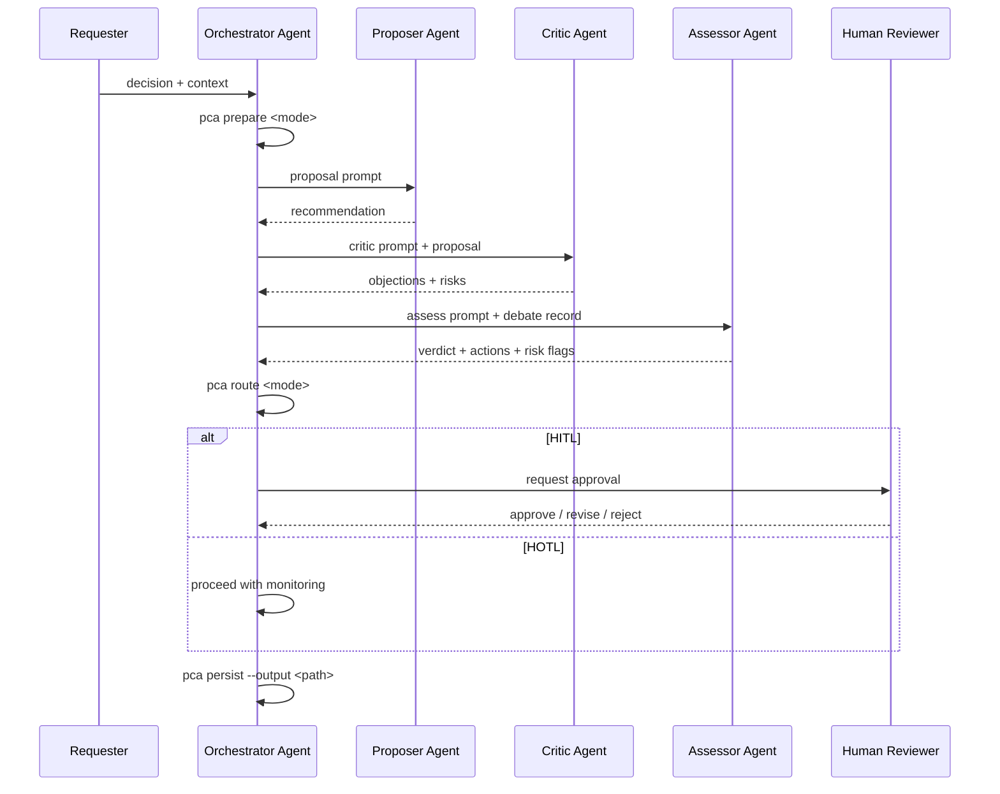

# PCA

PCA (Propose-Critique-Assess) is a standalone quality workflow engine inspired by GSD standards.

It applies structured debate, quality checks, and explicit governance (`HITL`/`HOTL`) to improve decision quality before execution.

"This project is independently developed. Any similarity to other systems reflects common industry patterns (for example proposer/critic/evaluator workflows) and does not imply code, prompt, or proprietary method reuse."

```text
██████╗   ██████╗    █████╗
██╔══██╗ ██╔════╝   ██╔══██╗
██████╔╝ ██║        ███████║
██╔═══╝  ██║        ██╔══██║
██║      ╚██████╗   ██║  ██║
╚═╝       ╚═════╝   ╚═╝  ╚═╝
```

## About The Author

I am a trained building architect and a working public servant, not a professional coder. I use AI to work smarter and build practical tools for the building and construction industry. My work focuses on automating compliance checks, improving design workflows, and exploring multi-agent AI patterns that help practitioners deliver safer, higher-quality buildings with less manual effort.

LinkedIn: `https://www.linkedin.com/in/woonwei/`

## Why PCA

- Independent workflow: use PCA in any project or stack.
- Quality-first: force assumptions and risks into the open.
- Traceable outputs: verdict + actions + risk flags.
- Governance-ready: clear routing to `HITL` or `HOTL`.

## Intent and Outcomes

PCA is designed to convert ambiguous multi-source decisions into structured, auditable outputs.

Intent:

- Build evidence from local sources in a repeatable way.
- Expose support and contradiction signals across documents.
- Produce explicit governance routing instead of implicit judgement.
- Preserve decision traceability for human review and automation.

Primary outputs:

- Evidence digest (`ingest`): source coverage, extracted claims, and corpus metrics.
- Evidence assessment (`evidence-check`): cross-document links (`support`/`contradiction`) plus evidence metrics.
- Governance decision (`route`/`assess`): verdict, risk flags, score summary, and `HITL`/`HOTL` recommendation.
- Persisted artifact (`persist`): stable JSON/Markdown record for audit trails and handoff.

Expected outcomes:

- Faster interpretation of large datasets.
- More consistent decision quality across runs and operators.
- Clear escalation criteria when confidence, coverage, or risk posture is insufficient.
- Better downstream execution safety via explicit human control gates.

Contract details for all outputs are defined in `SCHEMA.md`.

Prior art and acknowledgement log: `docs/PRIOR-ART.md`.

## Workflow Diagram



## Role and Agent Showcase

| Role | Typical Owner | Responsibility |
|---|---|---|
| Requester | Human | Provides decision and context |
| Orchestrator | AI agent or automation | Runs CLI commands and coordinates flow |
| Proposer | AI agent | Produces recommendation and assumptions |
| Critic | AI agent | Challenges recommendation and exposes risk |
| Assessor | AI agent | Produces verdict and required actions |
| Human Reviewer | Human | Final authority for HITL escalations |

Detailed workflow, swimlanes, and agent topology: `docs/WORKFLOW.md`

## Installation

### Local dev usage

```bash
npm install
node bin/pca.js prepare discuss --decision "API strategy" --context "Migrate safely"
```

### Optional global CLI usage

```bash
npm install -g .
pca prepare discuss --decision "Architecture framing" --context "Phase 1 migration"
```

## Web UI

PCA includes a local-first web UI for running OCR, conversion, quality checks, evidence checks, and downloading run artifacts.

```bash
npm run ui:start
```

Open `http://localhost:4173`.

Web UI guide (local + online deployment): `docs/WEB-UI.md`

Antigravity integration guide (CLI-only and hybrid UI workflows): `docs/ANTIGRAVITY-INTEGRATION.md`

## Command Reference

| Command | Purpose | Output |
|---|---|---|
| `pca prepare <discuss|verify>` | Build PCA session contract (framework + prompts) | JSON session object |
| `pca run <discuss|verify>` | Current alias of `prepare` for standalone MVP | JSON session object |
| `pca propose <discuss|verify>` | Build proposer payload and prompt | JSON proposer object |
| `pca critique <discuss|verify>` | Build critic payload, prompt, and extracted risks | JSON critic object |
| `pca route <discuss|verify>` | Compute governance routing from verdict/risk | JSON with `human_control` |
| `pca assess <discuss|verify>` | Build final PCA assessment payload | JSON assessment object |
| `pca persist <discuss|verify>` | Save assessment output to disk | JSON receipt + saved file |
| `pca ingest` | Ingest local sources into claim digest | JSON evidence digest |
| `pca quality-check` | Validate corpus quality before evidence-check | JSON quality gate report |
| `pca evidence-check <discuss|verify>` | Cross-document support/contradiction checks + assessment | JSON evidence + assessment |
| `pca help` | Show CLI usage and examples | Plain text reference |

Detailed per-command reference: `docs/COMMAND-REFERENCE.md`

TRHS PDF workflow (URA/BCA/SCDF, including confidential-file exclusion): `docs/USER-GUIDE.md#trhs-workflow-ura-bca-scdf`

Framework positioning note: PCA is domain-agnostic. TRHS, fire-egress, and agentic pipeline documents are optional use-case implementations on top of the same core framework.

## Example Commands

```bash
# Discuss framing
node bin/pca.js prepare discuss --decision "service boundary" --context "latency and ownership"

# Verify risk routing
node bin/pca.js route verify --verdict "accepted-with-conditions" --risk-flags "partial coverage"

# Role payloads for Propose and Critique
node bin/pca.js propose discuss --decision "service boundary" --sources "reports/a.md,reports/b.md"
node bin/pca.js critique discuss --decision "service boundary" --proposal "split by domain" --critique "Risk due to missing ownership model"

# Build final assessment payload
node bin/pca.js assess verify --verdict "accepted" --judgement "Evidence is reproducible"

# Persist assessment to markdown
node bin/pca.js persist verify --verdict "needs-human-review" --risk-flags "uncertain evidence" --output development/pca-assessment.md --format md

# Force human decision
node bin/pca.js route verify --verdict "needs-human-review" --needs-human-review true

# Ingest local documents/datasets (local server path)
node bin/pca.js ingest --sources "reports/a.md,reports/b.json,reports/c.csv"

# Batch convert any PDF folder to text for ingestion
npm run convert:pdf -- --input-dir "C:\\path\\to\\public-pdfs" --output-dir "data/public-pdf-text" --recursive true

# Optional OCR pre-step for scanned/image-only PDFs
npm run ocr:pdf -- --input-dir "C:\\path\\to\\public-pdfs" --output-dir "data/public-pdf-ocr" --recursive true --language eng
npm run convert:pdf -- --input-dir "data/public-pdf-ocr" --output-dir "data/public-pdf-text" --recursive true

# Batch convert URA/BCA/SCDF PDFs to text (excludes confidential correspondence by default)
npm run convert:trhs

# Quality gate before running evidence checks
node bin/pca.js quality-check --sources "data/public-pdf-text" --min-sources 2 --min-total-claims 6

# Cross-document evidence check with strict governance
node bin/pca.js evidence-check verify --decision "release gate" --sources "reports/a.md,reports/b.md" --policy strict

# Interpret converted large asset folder (requirements-prioritized)
node bin/pca.js evidence-check verify --decision "Interpret asset requirements" --sources "data/public-pdf-text" --max-files 120 --prioritize-requirements true --policy strict
```

Note: for charts/images/scanned PDFs, see `docs/USER-GUIDE.md#handling-tables-graphs-images-and-scanned-pdfs`.

## Quality Standard (GSD-Inspired)

PCA follows the same quality discipline pattern that makes GSD reliable:

- Explicit contracts for every command input/output.
- Deterministic JSON responses for automation.
- Mode-specific frameworks (`discuss`, `verify`) instead of generic scoring.
- Governance-first escalation (`HITL`/`HOTL`) rather than implicit risk handling.
- Test-backed behavior for core decision logic.

## Architecture

- Core logic: `src/pca-core.js`
- CLI: `bin/pca.js`
- Tests: `tests/pca-core.test.js`
- Design doc: `docs/PCA-ARCHITECTURE.md`
- Workflow and role model: `docs/WORKFLOW.md`
- JSON contract: `SCHEMA.md`
- Integration templates: `integrations/`
- Contributing/redevelopment guide: `CONTRIBUTING.md`

## Integrations

PCA is adapter-ready. Start with templates in:

- `integrations/copilot/`
- `integrations/gemini-antigravity/`
- `integrations/ollama/` (free/open local models)
- `integrations/byom/` (OpenAI-compatible bring-your-own-model setup)
- `integrations/gsd/` (install PCA as GSD quality overlay)

All integrations should consume the stable contract in `SCHEMA.md`.

Model routing guide (single-model, split-role, hybrid): `docs/MODEL-ROUTING.md`

GSD integration guide: `docs/GSD-INTEGRATION.md`

Use-case library (optional examples built on PCA core):

- Building compliance decision gate: `docs/USE-CASE-FIRE-EGRESS-COMPLIANCE.md`
- TRHS interpretation workflow: `docs/USE-CASE-TRHS-INTERPRETATION.md`
- Agentic TRHS pipeline: `docs/USE-CASE-AGENTIC-TRHS-PIPELINE.md`

Operational runbooks and release assurance:

- PDF parsing pipeline runbook: `docs/RUNBOOK-PDF-PIPELINE.md`
- OCR failure runbook: `docs/RUNBOOK-OCR-FAILURES.md`
- HITL escalation runbook: `docs/RUNBOOK-HITL-ESCALATION.md`
- Release quality checklist: `docs/RELEASE-CHECKLIST.md`

## Public Redevelopment

Anyone can fork and redevelop PCA under MIT.

Recommended fork pattern:

1. Keep `src/pca-core.js` contract-compatible.
2. Build custom adapters under `integrations/`.
3. Keep schema updates explicit in `SCHEMA.md`.

## Attribution

PCA is inspired by GSD's structured workflow discipline and extends it as an independent quality-first decision engine.

## Contact and Q&A

- Submit a query: https://forms.gle/Qdk6xzGDchnk9h2u7
- Browse past Q&A: https://docs.google.com/spreadsheets/d/1AbtKfvaiZCV3Fq6FoAEopUGhehiDHHaapCwKvlKnKNU/edit?usp=sharing

Do not submit confidential data.
