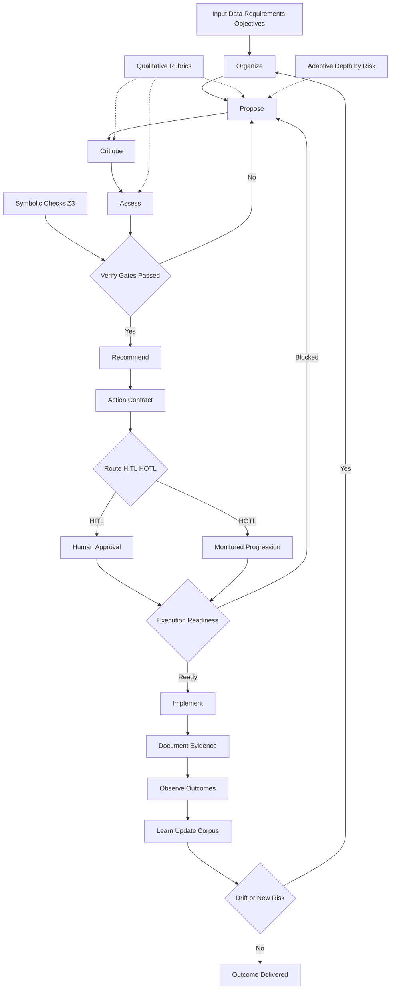

# PCA

PCA (Propose-Critique-Assess) is an Evidence-Governed Adaptive Solver for human-machine co-working.

It helps teams frame decisions, run adaptive propose-critique-assess loops, apply evidence and optional formal checks, and route actions through explicit governance (`HITL`/`HOTL`) before execution.

PCA runs consistently across three primary operating surfaces: VS Code, Antigravity, and the Browser UI, so the same governed workflow can be used in chat-first, orchestration-first, or visual control-desk workflows.

Product framing: the Browser UI can be treated as the platform, while PCA is the framework that shapes the roles, checkpoints, and process structure running on top of that platform. The core purpose is disciplined human-machine collaboration and co-creation. Productization, reusable assets, and practical solutions can emerge from that collaboration, but they are outcomes of the method rather than its only purpose.

"This project is independently developed. Any similarity to other systems reflects common industry patterns (for example proposer/critic/evaluator workflows) and does not imply code, prompt, or proprietary method reuse."

The examples and evidence packs in this repository are based on independent personal data exploration and publicly available regulatory datasets only. It does not include any internal, confidential, restricted, or otherwise non-public government material.

```text
██████╗   ██████╗    █████╗
██╔══██╗ ██╔════╝   ██╔══██╗
██████╔╝ ██║        ███████║
██╔═══╝  ██║        ██╔══██║
██║      ╚██████╗   ██║  ██║
╚═╝       ╚═════╝   ╚═╝  ╚═╝
```

## About The Author

Woon Wei Pong is a trained building architect and digital lead in the construction industry. His work focuses on AI-enabled compliance, design and BIM workflows, and human-machine collaboration for the built environment.

ORCID: https://orcid.org/0009-0004-6856-2189

## Why PCA

PCA exists for teams that need more than a fast answer.

- Independent workflow: use PCA across different stacks, runtimes, and operating environments.
- Quality-first: expose assumptions, contradictions, and unresolved risks before action.
- Traceable outputs: produce reviewable verdicts, actions, evidence signals, and route decisions.
- Governance-ready: move work forward with explicit `HITL` or `HOTL` routing instead of implicit judgement.
- Surface-flexible: run the same governed method in VS Code, Antigravity, or the Browser UI.

## Problem Statement

Human-machine collaboration often breaks down in two predictable ways:

- humans do not always know what they do not know, especially in ambiguous or high-stakes problems
- machines can generate fast answers, but they do not automatically understand what the human actually needs, what must be challenged, or when a decision should be escalated

In normal one-pass long conversations, these weaknesses compound over time. Important assumptions stay hidden, weak proposals go unchallenged, contradictions are missed, and the conversation often drifts toward whichever answer sounds plausible first.

PCA is designed to solve that failure mode. It turns a long, fragile, one-pass interaction into a governed decision loop that can expose assumptions, challenge weak logic, check evidence, and produce an actionable outcome with explicit human control.

In product terms, PCA is a decision-quality layer for human-machine work. It helps a team move from raw prompts and documents to governed collaboration that is easier to review, continue, hand off, automate, and defend.

That can itself be the product. The value is not only the final answer or artifact. The value is the reusable working pattern: how human intent is captured, how evidence is scoped, how proposals are challenged, how pauses and resumptions are handled, how checkpoints are made explicit, and how the structured reasoning trail is documented for continuation, review, action, and shared understanding.

## What PCA Can Do

PCA can be used as a general-purpose human-machine decision system for any domain where quality, traceability, and governance matter.

- Frame a problem clearly using objective, context, expectations, constraints, and policy.
- Generate structured multi-step reasoning instead of relying on a single-pass answer.
- Run `Propose -> Critique -> Assess` loops to test options before action.
- Ingest local documents and datasets and build an evidence digest from them.
- Run quality gates before deeper evidence analysis.
- Detect support, contradiction, coverage, and confidence patterns across multiple sources.
- Apply governance checks before moving from reasoning into action.
- Route outputs explicitly to `HOTL` or `HITL` depending on risk and readiness.
- Add optional symbolic validation with Z3 for hard constraints and feasibility checks.
- Produce audit-friendly artifacts for handoff, review, and repeatable execution.
- Work across Copilot, Antigravity, local terminal workflows, BYOM, Ollama, and browser-based UI/API usage.
- Expose PCA-native agent modes in VS Code for orchestrator, proposer, critic, assessor, and governor workflows.
- Provide an autonomous agent entrypoint for adaptive multi-pass PCA with optional Z3-backed verification when the human wants one governed run instead of manual stage selection.

## Which Surface To Use

PCA exposes the same governed method through three main operating surfaces. Choose the one that best matches how your team wants to work.

| Surface | Best For | Primary Controls | Choose This When |
| --- | --- | --- | --- |
| VS Code | Chat-first co-working, coding-adjacent decisions, agent-guided runs | CLI, custom PCA agents, local tasks | You want PCA embedded in your normal editor workflow and want to switch between autonomous and stage-specific agent modes |
| Antigravity | Orchestration-first workflows with PCA as a governance layer | PCA CLI, API, artifacts, runtime smoke checks | You already use Antigravity to drive execution and want PCA to structure evidence, critique, and routing around it |
| Browser UI | Visual control desk, live timeline review, downloadable artifacts | UI controls, live debate, adaptive depth, verify gates, optional Z3 checks | You want visible debate flow, human checkpoints, corpus preview, and a browser-first operating experience |

The underlying PCA logic remains the same across all three surfaces: frame the work, gather evidence, run adaptive proposal and critique passes, assess readiness, and route the result under explicit human control. What changes is the platform experience around it. In the Browser UI, that framework becomes a visible operating platform for shaping roles and streamlining lengthy conversations into documented process steps.

## Human-Machine Co-Working Method

PCA is built around the idea that human and machine should not behave as substitutes for one another. They should compensate for each other's blind spots.

- The human provides intent, judgement context, priorities, and accountability.
- The machine provides structure, memory, iteration, critique pressure, and evidence synthesis.
- PCA provides the operating method that keeps both sides aligned.

Instead of depending on one long conversation to carry everything, PCA breaks work into a repeatable loop:

1. `Propose`: generate the strongest current option.
2. `Critique`: challenge assumptions, gaps, risks, and contradictions.
3. `Assess`: decide what holds, what fails, and what needs human review.

That loop improves normal AI-assisted work in four important ways:

- it reduces premature convergence on the first plausible answer
- it makes hidden assumptions visible earlier
- it creates explicit decision points instead of conversational drift
- it produces outputs that are easier to review, reuse, and automate

Seen this way, PCA is a collaboration product as much as an analysis product. It packages a repeatable co-working pattern that can be reused across different domains, datasets, users, and runtimes without depending on one fragile conversation.

## Traceability and Transparency

PCA is designed to make decision work inspectable without depending on opaque one-pass conversations.

- It records structured decision artifacts rather than leaving important logic scattered across chat history.
- It preserves the chain of decision development through proposal, critique, assessment, evidence checks, gates, and final routing.
- It makes it easier for a human reviewer to understand what was proposed, what was challenged, what evidence was used, and why a decision was accepted, conditioned, or escalated.
- It supports human-machine teamwork by making the handoff points explicit instead of implicit.

This makes PCA suitable for human-machine:

- co-creation: shaping options together instead of accepting the first generated answer
- co-checks: reviewing claims, contradictions, risk flags, and gate outcomes together
- co-tasking: moving from reasoning into action with explicit ownership, readiness, and escalation logic

In PCA, transparency does not mean dumping unrestricted hidden reasoning. It means producing a usable, reviewable structured reasoning trail:

- objective and context
- evidence and corpus coverage
- proposal summary
- critique summary
- assessment verdict
- verify-gate status
- route recommendation
- persisted artifact for review, audit, or execution handoff

## Default Surface Behavior vs PCA Mode

PCA does not replace the native experience of each surface. It adds a governed operating method on top of VS Code, Antigravity, and the Browser UI.

| Dimension | Default or Raw Surface Behavior | PCA Mode |
| --- | --- | --- |
| Primary goal | Fast assistance, execution, or UI-driven operation | Governed decision quality |
| Typical output shape | One direct answer, action, or run result | Structured staged output |
| Problem framing | Optional, operator-dependent | Expected as part of the method |
| Critique step | May happen informally or not at all | Explicit and role-separated |
| Assessment verdict | Usually implicit | Explicit verdict with conditions |
| Governance routing | Usually not first-class | Explicit `HITL` or `HOTL` recommendation |
| Evidence handling | Helpful when requested | Central to the workflow |
| Formal verification | Not part of the default flow | Can include optional Z3-backed checks |
| Auditability | Varies by runtime or conversation | Designed for structured review and artifacts |
| Best fit | Fast drafting, direct execution, low-risk tasks, or lightweight review | Ambiguous, high-stakes, evidence-heavy, or review-sensitive work |

Use the default or raw surface behavior when speed and low-friction operation matter most.

Use PCA mode when the process itself needs to be defensible, inspectable, and governed across VS Code, Antigravity, or the Browser UI.

## How PCA Supports Existing Copilot Work

PCA is not intended to replace Copilot. It makes Copilot-assisted work more reliable.

- Copilot remains strong at fast drafting, coding, searching, and implementation assistance.
- PCA adds structure around framing, critique, evidence checking, governance, and action readiness.
- Copilot helps move quickly; PCA helps make sure the work is actually pointed in the right direction and safe to proceed.

In practice, this means PCA can streamline normal Copilot use by converting a long free-form chat into a more deliberate flow:

- frame the decision
- gather evidence
- run proposal and critique passes
- assess readiness and risk
- route to `HOTL` or `HITL`
- persist the result for action and review

This is especially useful for work that is ambiguous, multi-document, high-impact, or easy to get wrong with a single conversational pass.

## Robustness Acknowledgement

PCA now includes optional Python symbolic verification support via `z3-solver` (`requirements-z3.txt`).
This strengthens robustness by pairing qualitative reasoning (`Propose -> Critique -> Assess`) with formal feasibility checks (`sat/unsat`) inside verify gates and routing decisions.

## Intent and Outcomes

PCA is designed to convert ambiguous multi-source decisions into structured, auditable outputs.

Intent:

- Build evidence from local sources in a repeatable way.
- Expose support and contradiction signals across documents.
- Produce explicit governance routing instead of implicit judgement.
- Preserve decision traceability for human review and automation.

Primary outputs:

- Evidence digest (`ingest`): source coverage, extracted claims, and corpus metrics.
- Evidence assessment (`evidence-check`): cross-document links (`support`/`contradiction`) plus evidence metrics.
- Governance decision (`route`/`assess`): verdict, risk flags, score summary, and `HITL`/`HOTL` recommendation.
- Persisted artifact (`persist`): stable JSON/Markdown record for audit trails and handoff.

Expected outcomes:

- Faster interpretation of large datasets.
- More consistent decision quality across runs and operators.
- Clear escalation criteria when confidence, coverage, or risk posture is insufficient.
- Better downstream execution safety via explicit human control gates.
- Better traceability across the full human-machine decision loop.

Contract details for all outputs are defined in `SCHEMA.md`.

Prior art and acknowledgement log: `docs/PRIOR-ART.md`.

## Workflow Diagram



Operational rule: move forward only when qualitative assessment, symbolic feasibility, and execution readiness are all satisfied; otherwise loop back through `Propose -> Critique -> Assess` with updated evidence and constraints.

### Lifecycle (PCA Native ASCII)

```text
  ┌──────────────────────────────────────────────────────────┐
  │                     PCA DECISION RUN                     │
  │ Intake + Corpus + Objectives + Constraints + Policy      │
  │ + Risk Profile                                           │
  └─────────────────────────────┬────────────────────────────┘
                                │
                ┌───────────────▼────────────────┐
                │ ADAPTIVE DEPTH PLANNER         │
                │ 1 pass / 2 passes / 3 passes   │
                └───────────────┬────────────────┘
                                │
  ┌─────────────────────────────▼────────────────────────────┐
  │ PASS LOOP                                                │
  │ Organize -> Propose -> Critique -> Assess                │
  │ Update confidence, coverage, risk, assumptions           │
  └─────────────────────────────┬────────────────────────────┘
                                │
  ┌─────────────────────────────▼────────────────────────────┐
  │ GOVERNANCE GATE                                          │
  │ Evidence checks + policy thresholds + optional Z3        │
  └─────────────────────────────┬────────────────────────────┘
                   gate fail <--┘
                                │
                                │
                            gate pass
  ┌─────────────────────────────▼────────────────────────────┐
  │ ACTION PACKAGE                                           │
  │ Recommendation + contract + owner + due + rollback       │
  └─────────────────────────────┬────────────────────────────┘
                                │
                ┌───────────────▼────────────────┐
                │ ROUTING + READINESS CHECK      │
                │ HITL / HOTL + implementation   │
                └───────────────┬────────────────┘
                     blocked <--┘
                                │
                                │
                              ready
  ┌─────────────────────────────▼────────────────────────────┐
  │ EXECUTE -> OBSERVE -> CAPTURE -> LEARN -> RE-INGEST      │
  └──────────────────────────────────────────────────────────┘
```

### Execution Orchestration (PCA Native ASCII)

```text
  ┌──────────────────────────────────────────────────────────┐
  │              PCA PARALLEL ORCHESTRATION VIEW             │
  ├──────────────────────────────────────────────────────────┤
  │                                                          │
  │ STREAM A            STREAM B            STREAM C         │
  │ evidence            reasoning           action           │
  │ ┌──────────────┐    ┌──────────────┐    ┌──────────────┐ │
  │ │ Collect Docs │    │ Propose      │    │ Draft Action │ │
  │ │ Normalize Ref│    │ Critique     │    │ Contract     │ │
  │ └──────┬───────┘    │ Assess       │    └──────┬───────┘ │
  │        │            └──────┬───────┘           │         │
  │        │                   │                   │         │
  │        └───────────────────┬───────────────────┘         │
  │                            │                             │
  │                   ┌────────▼─────────┐                   │
  │                   │ Governance Merge │                   │
  │                   │ evidence policy  │                   │
  │                   │ and Z3 checks    │                   │
  │                   └────────┬─────────┘                   │
  │                            │                             │
  │                 fail loop  │  pass route readiness       │
  │                 ┌──────────▼───────────┐                 │
  │                 │ Execute and Monitor  │                 │
  │                 │ Feed next cycle      │                 │
  │                 └──────────────────────┘                 │
  │                                                          │
  └──────────────────────────────────────────────────────────┘
```

## Role and Agent Showcase

| Role | Typical Owner | Responsibility |
| --- | --- | --- |
| Requester | Human | Provides decision and context |
| Orchestrator | AI agent or automation | Runs CLI commands and coordinates flow |
| Proposer | AI agent | Produces recommendation and assumptions |
| Critic | AI agent | Challenges recommendation and exposes risk |
| Assessor | AI agent | Produces verdict and required actions |
| Human Reviewer | Human | Final authority for HITL escalations |

Detailed workflow, swimlanes, and agent topology: `docs/WORKFLOW.md`

## Installation

If you are using PCA in VS Code, start with the `VS Code Quick Start` section in `docs/USER-GUIDE.md`.

The same User Guide also includes `Antigravity Quick Start`, `Browser UI Quick Start`, and `Which Mode To Choose` for different user needs.

Workspace-level PCA custom agents are also available under `.github/agents/` for the VS Code agent picker.

### VS Code Agent Entry Modes

PCA now supports two ways to work in the VS Code agent picker:

- `PCA 0 Auto Flow`: one entrypoint for autonomous framing, adaptive debate depth, optional formal verification, and final routing.
- `PCA 1 Orchestrator` through `PCA 5 Governor`: manual stage entrypoints when the human wants tighter control over a specific phase.

Use `PCA 0 Auto Flow` when you want PCA to decide how much discussion depth is needed and whether hard-constraint verification should be part of the run.

Use the numbered stage agents when you want to intervene at a specific point or rerun only one stage.

### Local dev usage

```bash
npm install
node bin/pca.js prepare discuss --decision "API strategy" --context "Migrate safely"
```

### Optional global CLI usage

```bash
npm install -g .
pca prepare discuss --decision "Architecture framing" --context "Phase 1 migration"
```

## Web UI

PCA includes a local-first web UI for running OCR, conversion, quality checks, evidence checks, and downloading run artifacts.

```bash
npm run ui:start
```

Open `http://localhost:4173`.

The browser UI is localhost-only by default and restricts filesystem access to approved roots under `data/` and `outputs/`. To allow additional local dataset folders, set `PCA_UI_ALLOWED_ROOTS` before starting the UI.

It also enforces approved local host and browser-origin checks by default. If you intentionally run PCA behind a controlled proxy or hostname, extend `PCA_UI_ALLOWED_HOSTS` and `PCA_UI_ALLOWED_ORIGINS` explicitly.

Web UI guide (local + online deployment): `docs/WEB-UI.md`

Antigravity integration guide (CLI-only and hybrid UI workflows): `docs/ANTIGRAVITY-INTEGRATION.md`

## Command Reference

| Command | Purpose | Output |
| --- | --- | --- |
| `pca prepare <mode>` (`discuss` or `verify`) | Build PCA session contract (framework + prompts) | JSON session object |
| `pca run <mode>` (`discuss` or `verify`) | Current alias of `prepare` for standalone MVP | JSON session object |
| `pca propose <mode>` (`discuss` or `verify`) | Build proposer payload and prompt | JSON proposer object |
| `pca critique <mode>` (`discuss` or `verify`) | Build critic payload, prompt, and extracted risks | JSON critic object |
| `pca route <mode>` (`discuss` or `verify`) | Compute governance routing from verdict/risk | JSON with `human_control` |
| `pca assess <mode>` (`discuss` or `verify`) | Build final PCA assessment payload | JSON assessment object |
| `pca persist <mode>` (`discuss` or `verify`) | Save assessment output to disk | JSON receipt + saved file |
| `pca ingest` | Ingest local sources into claim digest | JSON evidence digest |
| `pca quality-check` | Validate corpus quality before evidence-check | JSON quality gate report |
| `pca evidence-check <mode>` (`discuss` or `verify`) | Cross-document support/contradiction checks + assessment | JSON evidence + assessment |
| `pca help` | Show CLI usage and examples | Plain text reference |

Detailed per-command reference: `docs/COMMAND-REFERENCE.md`

VS Code terminal and runtime quick guide: `docs/VS-CODE-CLI-CHEATSHEET.md`

TRHS PDF workflow (URA/BCA/SCDF, including confidential-file exclusion): `docs/USER-GUIDE.md#trhs-workflow-ura-bca-scdf`

Framework positioning note: PCA is domain-agnostic. TRHS, fire-egress, and agentic pipeline documents are optional use-case implementations on top of the same core framework.

## Example Commands

```bash
# Discuss framing
node bin/pca.js prepare discuss --decision "service boundary" --context "latency and ownership"

# Verify risk routing
node bin/pca.js route verify --verdict "accepted-with-conditions" --risk-flags "partial coverage"

# Role payloads for Propose and Critique
node bin/pca.js propose discuss --decision "service boundary" --sources "reports/a.md,reports/b.md"
node bin/pca.js critique discuss --decision "service boundary" --proposal "split by domain" --critique "Risk due to missing ownership model"

# Build final assessment payload
node bin/pca.js assess verify --verdict "accepted" --judgement "Evidence is reproducible"

# Persist assessment to markdown
node bin/pca.js persist verify --verdict "needs-human-review" --risk-flags "uncertain evidence" --output development/pca-assessment.md --format md

# Force human decision
node bin/pca.js route verify --verdict "needs-human-review" --needs-human-review true

# Ingest local documents/datasets (local server path)
node bin/pca.js ingest --sources "reports/a.md,reports/b.json,reports/c.csv"

# Batch convert any PDF folder to text for ingestion
npm run convert:pdf -- --input-dir "C:\\path\\to\\public-pdfs" --output-dir "data/public-pdf-text" --recursive true

# Optional OCR pre-step for scanned/image-only PDFs
npm run ocr:pdf -- --input-dir "C:\\path\\to\\public-pdfs" --output-dir "data/public-pdf-ocr" --recursive true --language eng
npm run convert:pdf -- --input-dir "data/public-pdf-ocr" --output-dir "data/public-pdf-text" --recursive true

# Batch convert URA/BCA/SCDF PDFs to text (excludes confidential correspondence by default)
npm run convert:trhs

# Quality gate before running evidence checks
node bin/pca.js quality-check --sources "data/public-pdf-text" --min-sources 2 --min-total-claims 6

# Cross-document evidence check with strict governance
node bin/pca.js evidence-check verify --decision "release gate" --sources "reports/a.md,reports/b.md" --policy strict

# Interpret converted large asset folder (requirements-prioritized)
node bin/pca.js evidence-check verify --decision "Interpret asset requirements" --sources "data/public-pdf-text" --max-files 120 --prioritize-requirements true --policy strict
```

Note: for charts/images/scanned PDFs, see `docs/USER-GUIDE.md#handling-tables-graphs-images-and-scanned-pdfs`.

## Quality Standards

PCA follows a quality-first discipline pattern:

- Explicit contracts for every command input/output.
- Deterministic JSON responses for automation.
- Mode-specific frameworks (`discuss`, `verify`) instead of generic scoring.
- Governance-first escalation (`HITL`/`HOTL`) rather than implicit risk handling.
- Test-backed behavior for core decision logic.

## Architecture

- Core logic: `src/pca-core.js`
- CLI: `bin/pca.js`
- Tests: `tests/pca-core.test.js`
- Design doc: `docs/PCA-ARCHITECTURE.md`
- Workflow and role model: `docs/WORKFLOW.md`
- JSON contract: `SCHEMA.md`
- Integration templates: `integrations/`
- Contributing/redevelopment guide: `CONTRIBUTING.md`

## Integrations

PCA is adapter-ready. Start with templates in:

- `integrations/copilot/`
- `integrations/gemini-antigravity/`
- `integrations/ollama/` (free/open local models)
- `integrations/byom/` (OpenAI-compatible bring-your-own-model setup)
- `integrations/gsd/` (external executor integration example)
- `integrations/z3/` (optional symbolic constraint solver checks)

All integrations should consume the stable contract in `SCHEMA.md`.

Model routing guide (single-model, split-role, hybrid): `docs/MODEL-ROUTING.md`

Optional symbolic verification (Python + Z3):

```bash
pip install -r requirements-z3.txt
npm test
```

When Z3 is available, `tests/z3-geometry.test.js` validates a geometric constraint satisfaction scenario and can support adaptive solver verification experiments.

External executor integration guide (GSD example): `docs/GSD-INTEGRATION.md`

Use-case library (optional examples built on PCA core):

- Building compliance decision gate: `docs/USE-CASE-FIRE-EGRESS-COMPLIANCE.md`
- TRHS interpretation workflow: `docs/USE-CASE-TRHS-INTERPRETATION.md`
- Agentic TRHS pipeline: `docs/USE-CASE-AGENTIC-TRHS-PIPELINE.md`
- Hybrid quantitative + qualitative guide: `docs/USE-CASES-PCA-Z3.md`

Operational runbooks and release assurance:

- PDF parsing pipeline runbook: `docs/RUNBOOK-PDF-PIPELINE.md`
- OCR failure runbook: `docs/RUNBOOK-OCR-FAILURES.md`
- HITL escalation runbook: `docs/RUNBOOK-HITL-ESCALATION.md`
- Release quality checklist: `docs/RELEASE-CHECKLIST.md`

## Public Redevelopment

Anyone can fork and redevelop PCA under MIT.

Recommended fork pattern:

1. Keep `src/pca-core.js` contract-compatible.
2. Build custom adapters under `integrations/`.
3. Keep schema updates explicit in `SCHEMA.md`.

## Attribution

PCA is an independently developed quality-first decision engine.

## Contact and Q&A

- Submit a query: [Google Form](https://forms.gle/Qdk6xzGDchnk9h2u7)
- Browse past Q&A: [Google Sheet](https://docs.google.com/spreadsheets/d/1AbtKfvaiZCV3Fq6FoAEopUGhehiDHHaapCwKvlKnKNU/edit?usp=sharing)

Do not submit confidential data.
