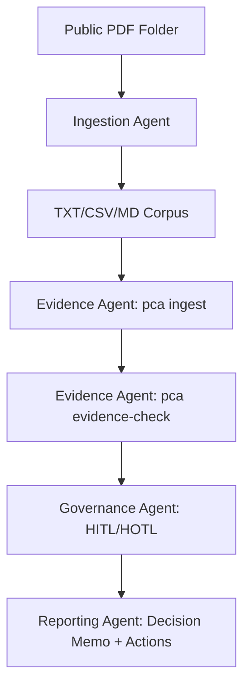

# Use Case: Agentic TRHS Pipeline (Optional)

This use case shows how to run PCA with agentic orchestration for TRHS interpretation. It is an optional operating mode, not a requirement for using PCA.

## Positioning

- PCA remains a general-purpose framework for quality decision workflows.
- This document demonstrates one domain application: TRHS interpretation across URA, BCA, and SCDF materials.
- You can apply the same pattern to other domains by changing ingestion filters, prompts, and policy thresholds.

## Why Agentic Mode

Agentic mode reduces manual effort in high-volume document review by automating repetitive tasks while preserving human governance for critical decisions.

## Agent Roles

1. Ingestion Agent
- Watches incoming public PDF folders.
- Runs batch conversion to `.txt`.
- Applies exclusion list (for confidential files).

2. Normalization Agent
- Cleans conversion artifacts.
- Extracts tabular data to `.csv` when needed.
- Adds analyst notes for charts/images into `.md`.

3. Evidence Agent
- Runs `pca ingest` and `pca evidence-check`.
- Captures support/contradiction metrics.

4. Governance Agent
- Evaluates verdict/policy results.
- Routes to `HITL` or `HOTL`.

5. Reporting Agent
- Generates implementation memo.
- Produces actions, owners, due dates, and source traceability.

## End-to-End Flow



## Command Blueprint

### 1) Convert folder PDFs to text

```bash
npm run convert:pdf -- --input-dir "C:\\path\\to\\public-pdfs" --output-dir "data/public-pdf-text" --recursive true
```

### 2) Build evidence digest

```bash
node bin/pca.js ingest --sources "data/public-pdf-text" --max-files 200 --prioritize-requirements true
```

### 3) Run strict decision check

```bash
node bin/pca.js evidence-check verify --decision "Interpret regulatory requirements" --context "Cross-document support and contradiction review" --sources "data/public-pdf-text" --policy strict --max-files 200 --prioritize-requirements true
```

### 4) Persist governed output

```bash
node bin/pca.js persist verify --verdict "accepted-with-conditions" --judgement "Proceed with tracked clarifications" --actions "Assign owners and due dates for unresolved items" --policy strict --output outputs/agentic-decision.json --format json
```

## Governance Guardrails

- Keep final approval in `HITL` for life-safety or high-impact outcomes.
- Require source traceability for each recommended action.
- Treat low-confidence OCR/table extraction as manual-review required.
- Keep versioned output artifacts for auditability.

## What to Expect

- Faster review cycles for large public document sets.
- Consistent evidence extraction and contradiction checks.
- Clear escalation behavior based on policy and evidence quality.
- Reusable pattern for domains beyond TRHS.
