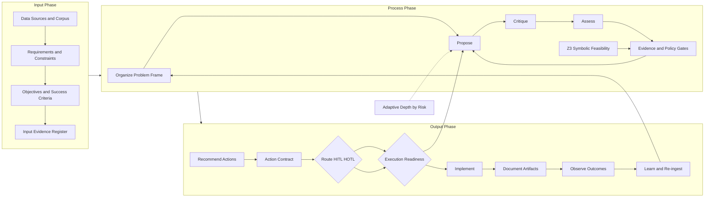

# PCA + Z3 Use Cases: Quantitative and Qualitative Hybrid Solver

This guide defines how PCA operates as a brainy adaptive solver by combining:

- Qualitative reasoning: `Propose -> Critique -> Assess`
- Quantitative symbolic verification: optional Python `z3-solver` checks
- Adaptive in-depth loops based on risk and confidence

## Core Operating Model

`Input -> Process -> Output`

- Input:
- Data, references, and dataset register
- Requirements (`must`, `should`, constraints)
- Objectives and acceptance criteria
- Process:
- Organize: normalize scope, assumptions, rubrics, and hard constraints
- Test: iterative `Propose -> Critique -> Assess`
- Verify: evidence gates + optional Z3 feasibility (`sat/unsat`)
- Output:
- Recommend actions
- Route `HITL/HOTL`
- Implement (or hold for approval)
- Document artifacts and rationale

## Overall PCA Diagram



Reading note:

- PCA reasoning loop (`Propose -> Critique -> Assess`) drives qualitative intelligence.
- Z3 feasibility check adds formal quantitative validation for hard constraints.
- Output is execution-oriented: action contract, readiness gate, implementation, and learning loop.

## Hybrid Qualitative + Quantitative Pattern

For each decision cycle:

1. Qualitative pass (PCA debate):

- Propose strongest actionable option.
- Critique assumptions, edge cases, and risks.
- Assess confidence, completeness, and governance implications.

1. Quantitative pass (Z3 symbolic):

- Encode hard constraints as logic/math rules.
- `sat` means a feasible configuration exists.
- `unsat` means constraints cannot all be satisfied.

1. Gate decision:

- Proceed only if qualitative assessment and symbolic feasibility pass.
- Otherwise iterate with deeper analysis or escalate to `HITL`.

## Adaptive In-Depth Policy

- Low risk: 1 pass
- Medium risk: 2 passes
- High risk: 3 passes

Escalate depth when:

- contradictions remain unresolved
- confidence drops
- symbolic check returns `unsat` or error

Stop when:

- verify gates pass
- score deltas plateau
- no new critical risks appear

## 10 Use Cases with Hybrid Strategy

1. Automated Pre-Submission (CORENET X)

- Decision focus: select the smallest set of design edits that resolves rule failures before submission.
- Outcome improvement: fewer late-cycle submission rejections, less rework, and clearer remediation priorities for QPs and reviewers.
- Process improvement: replace manual back-and-forth checking with a repeatable pre-submission loop that frames scope, checks evidence, and routes unresolved issues early.
- Qualitative: interpret rule intent, prioritize remediation sequence, and weigh design-disruption trade-offs.
- Quantitative (Z3): enforce encoded parameter and rule satisfiability for hard submission constraints.
- PCA deliverable: corrected submission action pack, evidence trail, and route decision.

1. Accessible Routes and Facilities

- Decision focus: choose route and facility adjustments that remain compliant while preserving usability and circulation quality.
- Outcome improvement: higher confidence that accessible routes are both code-compliant and practically usable, not merely nominally checked.
- Process improvement: move from isolated dimension checks to a governed route-review process that compares options, surfaces contradictions, and explains why a route should pass or escalate.
- Qualitative: user experience trade-offs such as detour burden, continuity, and functional usability.
- Quantitative (Z3): turning radius, slope, width, and clearance feasibility.
- PCA deliverable: feasible route options or `HITL` escalation when `unsat`.

1. Buildability and Constructability Optimizer

- Decision focus: identify the best buildability improvements without creating compliance or constructability regressions.
- Outcome improvement: better productivity, fewer avoidable site complications, and more disciplined trade-off selection across design alternatives.
- Process improvement: convert buildability discussions from subjective preference debates into structured option comparison with explicit assumptions, constraints, and acceptance conditions.
- Qualitative: practicality, sequencing risk, and design-intent impact.
- Quantitative (Z3): valid component and system combinations under hard constraints.
- PCA deliverable: best feasible buildability recommendation set with conditions and risk flags.

1. MEP and C&S Clash-Aware Design

- Decision focus: choose rerouting or resizing options that remove clashes without weakening engineering quality or maintainability.
- Outcome improvement: fewer downstream coordination failures, fewer ad hoc fixes on site, and stronger confidence in selected reroute options.
- Process improvement: evolve clash resolution from geometric detection into evidence-governed option review with explicit engineering trade-offs and feasibility gates.
- Qualitative: engineering trade-offs, serviceability, and constructability implications.
- Quantitative (Z3): non-overlap, clearance, and routing constraints.
- PCA deliverable: reroute and re-dimension options with formal feasibility proof and governance route.

1. Envelope and Systems Optimization (Green Mark)

- Decision focus: choose envelope or systems adjustments that improve performance while respecting code, comfort, and design intent.
- Outcome improvement: stronger performance-oriented recommendations with clearer limits on what can change without over-redesigning the scheme.
- Process improvement: make sustainability trade-offs explicit through structured comparison, evidence-backed thresholds, and gated action recommendations.
- Qualitative: architectural impact, comfort intent, and design trade-offs.
- Quantitative (Z3): threshold and bounds feasibility checks.
- PCA deliverable: compliant parameter envelope and prioritized action list.

1. Maintainability and FM Access Checks

- Decision focus: confirm whether service rooms, plant layouts, and replacement paths are maintainable before handover or major redesign.
- Outcome improvement: fewer hidden FM constraints, safer servicing conditions, and lower lifecycle disruption risk.
- Process improvement: shift maintainability review from late-stage discovery into a documented decision loop that tests operational practicality and access feasibility together.
- Qualitative: operational practicality and lifecycle maintainability.
- Quantitative (Z3): access clearances and replacement path feasibility.
- PCA deliverable: maintainable layout options or gated escalation with explicit blockers.

1. HS Requirements vs Drawings

- Decision focus: determine which health and safety issues are real, material, and urgent enough to escalate.
- Outcome improvement: higher-confidence HS findings, fewer weak or noisy flags, and better prioritization of critical risks.
- Process improvement: replace unstructured issue spotting with a disciplined verification path that links rule interpretation, drawing evidence, and risk-based escalation.
- Qualitative: severity, contextual safety interpretation, and priority setting.
- Quantitative (Z3): mandatory safety distances, guards, and opening constraints.
- PCA deliverable: verified non-compliance pack prioritized by risk and readiness.

1. Cost Verification (Specs vs Tender)

- Decision focus: determine which cost discrepancies are material, explainable, and worth intervention before award or payment.
- Outcome improvement: fewer commercial surprises, clearer package-level discrepancy handling, and stronger confidence in cost-review outcomes.
- Process improvement: move from spreadsheet-only anomaly spotting to a governed discrepancy workflow that checks source consistency, measurement logic, and escalation thresholds.
- Qualitative: materiality and commercial impact interpretation.
- Quantitative (Z3): consistency constraints and measurement-rule validity.
- PCA deliverable: actionable discrepancy pack with confidence flags and next actions.

1. Specification vs Drawing Consistency

- Decision focus: decide whether a spec-drawing mismatch is a true coordination issue, an acceptable equivalent, or a false alarm.
- Outcome improvement: fewer false positives, clearer clause-to-element traceability, and stronger confidence in coordination findings.
- Process improvement: convert specification review into a structured consistency workflow with explicit equivalence logic, criticality assessment, and traceable resolution paths.
- Qualitative: acceptable equivalence and intent-aware interpretation.
- Quantitative (Z3): presence and consistency constraints across clauses and tags.
- PCA deliverable: true mismatches only, with reduced false positives and clearer remediation steps.

1. BCA Master Compliance Pre-Check

- Decision focus: decide overall submission or design readiness across multiple compliance domains before formal review.
- Outcome improvement: earlier identification of cross-domain blockers, stronger readiness judgement, and clearer sequencing of remediation work.
- Process improvement: replace fragmented discipline-by-discipline checks with one governed pre-check that merges evidence, critique, verify gates, and routing into a single readiness view.
- Qualitative: cross-domain priority, remediation strategy, and escalation judgement.
- Quantitative (Z3): aggregate hard-rule satisfiability across domains.
- PCA deliverable: consolidated readiness verdict with `HITL/HOTL` route and remediation priorities.

## Practical Implementation Notes

- Keep Z3 focused on hard constraints and feasibility proofs.
- Keep PCA debate focused on interpretation, trade-offs, and governance.
- Persist both qualitative and symbolic outputs into artifacts.
- Route decisions from combined verify gates, not one side alone.

## Minimal Setup for Symbolic Checks

```bash
pip install -r requirements-z3.txt
npm test
```

When Z3 is installed, symbolic tests run in `tests/z3-geometry.test.js`.
