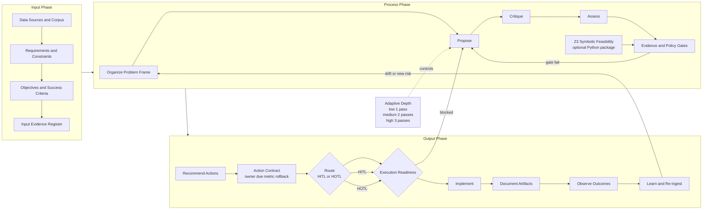

# PCA + Z3 Use Cases: Quantitative and Qualitative Hybrid Solver

This guide defines how PCA operates as a brainy adaptive solver by combining:

- Qualitative reasoning: `Propose -> Critique -> Assess`
- Quantitative symbolic verification: optional Python `z3-solver` checks
- Adaptive in-depth loops based on risk and confidence

## Core Operating Model

`Input -> Process -> Output`

- Input:
- Data, references, and dataset register
- Requirements (`must`, `should`, constraints)
- Objectives and acceptance criteria
- Process:
- Organize: normalize scope, assumptions, rubrics, and hard constraints
- Test: iterative `Propose -> Critique -> Assess`
- Verify: evidence gates + optional Z3 feasibility (`sat/unsat`)
- Output:
- Recommend actions
- Route `HITL/HOTL`
- Implement (or hold for approval)
- Document artifacts and rationale

## Overall PCA Diagram



Reading note:

- PCA reasoning loop (`Propose -> Critique -> Assess`) drives qualitative intelligence.
- Z3 feasibility check adds formal quantitative validation for hard constraints.
- Output is execution-oriented: action contract, readiness gate, implementation, and learning loop.

## Hybrid Qualitative + Quantitative Pattern

For each decision cycle:

1. Qualitative pass (PCA debate):
- Propose strongest actionable option.
- Critique assumptions, edge cases, and risks.
- Assess confidence, completeness, and governance implications.

2. Quantitative pass (Z3 symbolic):
- Encode hard constraints as logic/math rules.
- `sat` means a feasible configuration exists.
- `unsat` means constraints cannot all be satisfied.

3. Gate decision:
- Proceed only if qualitative assessment and symbolic feasibility pass.
- Otherwise iterate with deeper analysis or escalate to `HITL`.

## Adaptive In-Depth Policy

- Low risk: 1 pass
- Medium risk: 2 passes
- High risk: 3 passes

Escalate depth when:

- contradictions remain unresolved
- confidence drops
- symbolic check returns `unsat` or error

Stop when:

- verify gates pass
- score deltas plateau
- no new critical risks appear

## 10 Use Cases with Hybrid Strategy

1. Automated Pre-Submission (CORENET X)
- Qualitative: interpret rule intent, prioritize remediation sequence.
- Quantitative (Z3): enforce encoded parameter/rule satisfiability.
- Output: corrected submission actions + route decision.

2. Accessible Routes and Facilities
- Qualitative: user experience trade-offs (detour, usability).
- Quantitative (Z3): turning radius, slope, width, and clearance feasibility.
- Output: feasible route options or `HITL` escalation when `unsat`.

3. Buildability and Constructability Optimizer
- Qualitative: practicality, sequencing risk, design intent impact.
- Quantitative (Z3): valid component/system combinations under hard constraints.
- Output: best feasible buildability recommendation set.

4. MEP and C&S Clash-Aware Design
- Qualitative: engineering trade-offs and constructability implications.
- Quantitative (Z3): non-overlap, clearance, and routing constraints.
- Output: reroute/re-dimension options with formal feasibility proof.

5. Envelope and Systems Optimization (Green Mark)
- Qualitative: architectural impact, comfort intent, design trade-offs.
- Quantitative (Z3): threshold and bounds feasibility checks.
- Output: compliant parameter envelope + prioritized actions.

6. Maintainability and FM Access Checks
- Qualitative: operational practicality and lifecycle maintainability.
- Quantitative (Z3): access clearances, replacement path feasibility.
- Output: maintainable layouts or gated escalation.

7. HS Requirements vs Drawings
- Qualitative: severity and contextual safety interpretation.
- Quantitative (Z3): mandatory safety distances/guards/opening constraints.
- Output: verified non-compliances prioritized by risk.

8. Cost Verification (Specs vs Tender)
- Qualitative: materiality and commercial impact interpretation.
- Quantitative (Z3): consistency constraints and measurement-rule validity.
- Output: actionable discrepancy pack with confidence flags.

9. Specification vs Drawing Consistency
- Qualitative: acceptable equivalence and intent-aware interpretation.
- Quantitative (Z3): presence/consistency constraints across clauses and tags.
- Output: true mismatches only, with reduced false positives.

10. BCA Master Compliance Pre-Check
- Qualitative: cross-domain priority and remediation strategy.
- Quantitative (Z3): aggregate hard-rule satisfiability across domains.
- Output: consolidated readiness verdict + `HITL/HOTL` route.

## Practical Implementation Notes

- Keep Z3 focused on hard constraints and feasibility proofs.
- Keep PCA debate focused on interpretation, trade-offs, and governance.
- Persist both qualitative and symbolic outputs into artifacts.
- Route decisions from combined verify gates, not one side alone.

## Minimal Setup for Symbolic Checks

```bash
pip install -r requirements-z3.txt
npm test
```

When Z3 is installed, symbolic tests run in `tests/z3-geometry.test.js`.