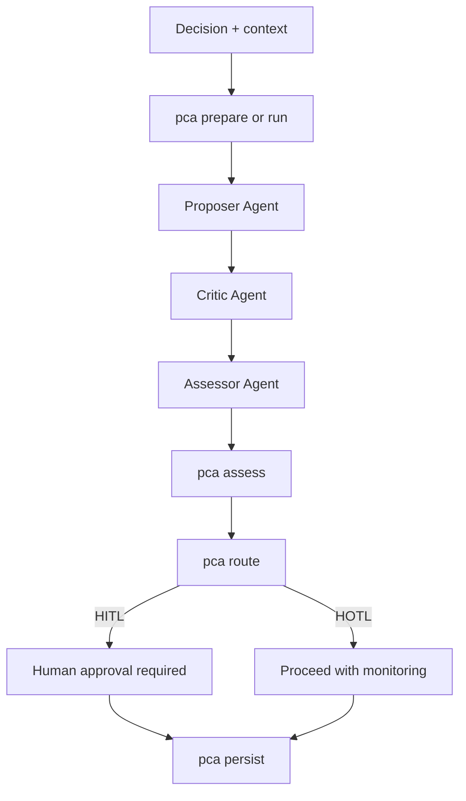

# PCA User Guide

This guide defines PCA operational use, command behavior, governance routing, and quality standards.

## General Framework vs Specific Use Cases

PCA is a general decision-quality framework. The core commands and governance model are domain-agnostic.

Specific use-case documents (for example TRHS or fire-egress) are optional implementation patterns that reuse the same PCA core:

- `prepare|run` for session framing
- `propose|critique` for structured debate
- `quality-check` for corpus readiness gating
- `ingest|evidence-check` for evidence synthesis
- `assess|route|persist` for verdict, governance, and audit artifacts

## Core Lifecycle

PCA decision lifecycle:

1. Propose: produce strongest actionable recommendation.
2. Critique: challenge assumptions, evidence, and failure modes.
3. Assess: issue final verdict and required next actions.

Verdict set:

- `accepted`
- `accepted-with-conditions`
- `needs-human-review`

## Workflow Diagram



Detailed role swimlane and agent topology: `docs/WORKFLOW.md`

## Roles and Agents

| Stage | Primary Role | Typical Runtime |
|---|---|---|
| Input framing | Requester | Human |
| Session preparation | Orchestrator | AI agent/CI |
| Proposal generation | Proposer | AI agent |
| Critique generation | Critic | AI agent |
| Final judgement | Assessor | AI agent |
| Governance gate | Human Reviewer (when HITL) | Human |
| Artifact persistence | Orchestrator | AI agent/CI |

## Installation

```bash
npm install
```

Optional global executable:

```bash
npm install -g .
```

Web UI (local-first, downloadable artifacts, online deployment guidance): `docs/WEB-UI.md`

For live visibility, use the Web UI `Run Live Debate x3` action to stream proposer/critic/assessor events and a final human checkpoint.

VS Code quick trial with Copilot runtime tags is available via tasks in `.vscode/tasks.json`:

- `PCA: Start UI Server`
- `PCA: Copilot Framework Proposal`
- `PCA: Copilot Research Pack`
- `PCA: Copilot Live Debate (1 cycle smoke)`

Antigravity integration (CLI-only and hybrid UI workflows): `docs/ANTIGRAVITY-INTEGRATION.md`

### Free/Open Local Model Path

PCA can run without paid APIs using local OSS models via Ollama:

1. Install Ollama: https://ollama.com/download
2. Pull models, for example: `qwen2.5:7b`, `llama3.1:8b`, `qwen2.5:14b`
3. Run adapter: `node integrations/ollama/adapter.js discuss --decision "..." --context "..."`

Model selection strategy and routing patterns: `docs/MODEL-ROUTING.md`

## Commands

Full command specification (syntax, flags, outputs, failure modes): `docs/COMMAND-REFERENCE.md`

### `prepare`

Builds a PCA session package with framework + prompts.

```bash
node bin/pca.js prepare discuss --decision "Should we split the service?" --context "Latency spikes at peak"
```

### `run`

Current standalone alias for `prepare`.

```bash
node bin/pca.js run verify --decision "Release readiness" --context "UAT shows intermittent errors"
```

### `propose`

Builds proposer role payload and prompt, optionally with local evidence digest.

```bash
node bin/pca.js propose discuss --decision "Should we split the service?" --sources "reports/a.md,reports/b.md"
```

### `critique`

Builds critic role payload and extracts risk flags from critique text.

```bash
node bin/pca.js critique discuss --decision "Should we split the service?" --proposal "Split by domain" --critique "Risk due to unclear ownership and missing rollback details"
```

### `route`

Maps verdict/risk to governance control (`HITL` or `HOTL`).

```bash
node bin/pca.js route verify --verdict "accepted-with-conditions" --risk-flags "partial coverage"
```

### `assess`

Builds the full PCA assessment payload from verdict + risk context.

```bash
node bin/pca.js assess verify --verdict "accepted" --judgement "Evidence is reproducible"
```

### `persist`

Writes assessment output to disk in JSON or Markdown format.

```bash
node bin/pca.js persist verify --verdict "needs-human-review" --risk-flags "uncertain evidence" --output development/pca-assessment.json --format json
```

### `help`

Prints concise CLI usage in terminal.

```bash
node bin/pca.js help
```

### `ingest`

Build local claim digest from files (`.md`, `.txt`, `.json`, `.csv`) without sending data off-server.

```bash
node bin/pca.js ingest --sources "reports/a.md,reports/b.csv"
```

### `quality-check`

Validate source quality before cross-document evidence checks.

```bash
node bin/pca.js quality-check --sources "data/public-pdf-text" --min-sources 2 --min-total-claims 6 --min-avg-claims-per-doc 2
```

### `evidence-check`

Run cross-document checks (support vs contradiction) and generate PCA assessment.

```bash
node bin/pca.js evidence-check verify --decision "release gate" --sources "reports/a.md,reports/b.md" --policy strict
```

For extensive datasets where the directory already contains supported files (`.md`, `.txt`, `.json`, `.csv`), pass the directory directly and cap file selection:

```bash
node bin/pca.js evidence-check verify --decision "Interpret requirements from normalized asset library" --context "Cross-check requirements consistency and contradictions" --sources "data/public-pdf-text" --max-files 120 --prioritize-requirements true --policy strict
```

## Specific Use Case: TRHS Workflow (URA, BCA, SCDF)

Use this flow when your regulatory source library is mostly PDF files.

Important:

- PCA ingest currently supports `.md`, `.txt`, `.json`, `.csv` directly.
- Convert PDF files to `.txt` first, then run PCA on the converted folder.
- Exclude confidential correspondence files from conversion and ingestion.

General batch conversion (any public-user PDF folder):

```bash
npm run convert:pdf -- --input-dir "C:\\path\\to\\public-pdfs" --output-dir "data/public-pdf-text" --recursive true
```

### Step 1: Convert public regulator PDFs to text

Example for your local dataset in `C:\2026_Research\Assets`:

One command (recommended):

```bash
npm run convert:trhs
```

Equivalent manual command:

```powershell
New-Item -ItemType Directory -Force -Path "data\trhs-text" | Out-Null
Get-ChildItem -Path "C:\2026_Research\Assets" -File |
	Where-Object { $_.Extension -ieq ".pdf" -and $_.Name -match '^(BCA|URA|SCDF)_' -and $_.Name -ne 'BCA_HS_Checks_Scope.pdf' } |
	ForEach-Object {
		$out = Join-Path "data\trhs-text" ($_.BaseName + ".txt")
		& "C:\poppler\Library\bin\pdftotext.exe" -layout -enc UTF-8 $_.FullName $out
	}
```

### Step 2: Build evidence digest

```bash
node bin/pca.js ingest --sources "data/trhs-text" --max-files 120 --prioritize-requirements true
```

### Step 3: Run strict cross-agency evidence-check

```bash
node bin/pca.js evidence-check verify --decision "TRHS interpretation for household shelter compliance (URA/BCA/SCDF)" --context "Cross-agency technical requirements, constraints, and contradiction checks" --sources "data/trhs-text" --max-files 120 --prioritize-requirements true --policy strict
```

### Step 4: Persist final decision artifact

```bash
node bin/pca.js persist verify --verdict "accepted-with-conditions" --judgement "Proceed with tracked clarifications and authority validation" --actions "1) confirm TRHS slab/setback conditions; 2) validate SCDF fire resistance and access implications; 3) confirm URA lodgment applicability with QP" --policy strict --output outputs/trhs-decision.json --format json
```

### Expected outcome pattern

- Structured evidence links across BCA/SCDF/URA sources.
- Explicit governance routing (`HITL`/`HOTL`) from policy and evidence quality.
- Reusable JSON output for review meetings and project records.

### Handling tables, graphs, images, and scanned PDFs

- Tables: `pdftotext -layout` preserves rough structure, but complex merged cells may degrade. For critical tables, export table data to CSV and ingest both `.txt` and `.csv`.
- Graphs/charts: chart visuals are not converted into reliable numeric text. Add a short analyst summary `.md` describing key values/thresholds and ingest that alongside converted text.
- Embedded images/diagrams: pure image content is not captured by `pdftotext`. Add manual captions/notes in `.md` for decision-relevant details.
- Scanned PDFs (image-only): run OCR first, then convert OCR output to text for PCA ingestion.
- Optional built-in OCR preprocessor command:

```bash
npm run ocr:pdf -- --input-dir "C:\\path\\to\\public-pdfs" --output-dir "data/public-pdf-ocr" --recursive true --language eng
npm run convert:pdf -- --input-dir "data/public-pdf-ocr" --output-dir "data/public-pdf-text" --recursive true
```

- If OCRmyPDF is not in PATH, set `--ocrmypdf-path` or env `OCRMYPDF_PATH`.
- Quality gate recommendation: sample 5 to 10 converted files and verify key clauses survived conversion before full evidence-check.

## Governance Model

- `HITL` (Human In The Loop): explicit human approval required.
- `HOTL` (Human On The Loop): progression allowed with monitoring.

Default escalation cues:

- `needs-human-review` verdict.
- unresolved high-risk flags.
- conflicting evidence in verify mode.

## Quality Standards (GSD-Inspired)

PCA adopts these standards:

- Deterministic machine-readable outputs (JSON-first CLI behavior).
- Clear command contracts and error messages.
- Mode-specific frameworks for discuss vs verify.
- Explicit governance routing, never implicit risk acceptance.
- Test coverage for core logic and edge cases.

## Practical Usage Guidance

Use PCA when:

- decision impact is high
- assumptions are uncertain
- evidence is incomplete or conflicting

Skip PCA when:

- tasks are low-risk and mechanical
- decision is already constrained and obvious

Practical end-to-end example (building compliance): `docs/USE-CASE-FIRE-EGRESS-COMPLIANCE.md`

Specific TRHS interpretation example: `docs/USE-CASE-TRHS-INTERPRETATION.md`

Optional agentic orchestration example (TRHS pipeline): `docs/USE-CASE-AGENTIC-TRHS-PIPELINE.md`

Operational runbooks and release assurance:

- `docs/RUNBOOK-PDF-PIPELINE.md`
- `docs/RUNBOOK-OCR-FAILURES.md`
- `docs/RUNBOOK-HITL-ESCALATION.md`
- `docs/RELEASE-CHECKLIST.md`

## Troubleshooting

- If you see `mode must be 'discuss' or 'verify'`, fix the second positional arg.
- If routing looks too strict, revisit `--verdict`, `--risk-flags`, and `--needs-human-review` values.
- If integrating with other tools, use JSON output as the stable contract.

## Contact and Q&A

- Submit a query: https://forms.gle/Qdk6xzGDchnk9h2u7
- Browse past Q&A: https://docs.google.com/spreadsheets/d/1AbtKfvaiZCV3Fq6FoAEopUGhehiDHHaapCwKvlKnKNU/edit?usp=sharing

Do not submit confidential data.
