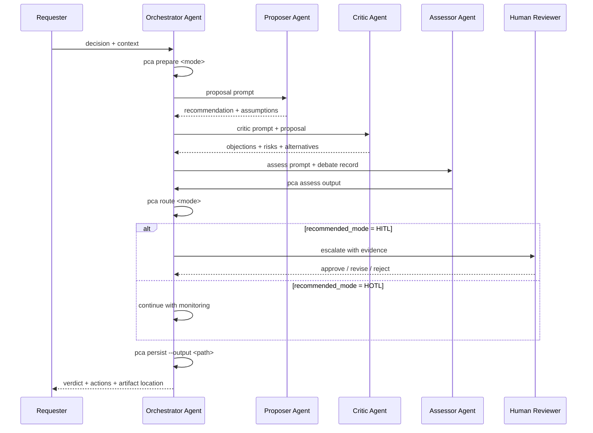
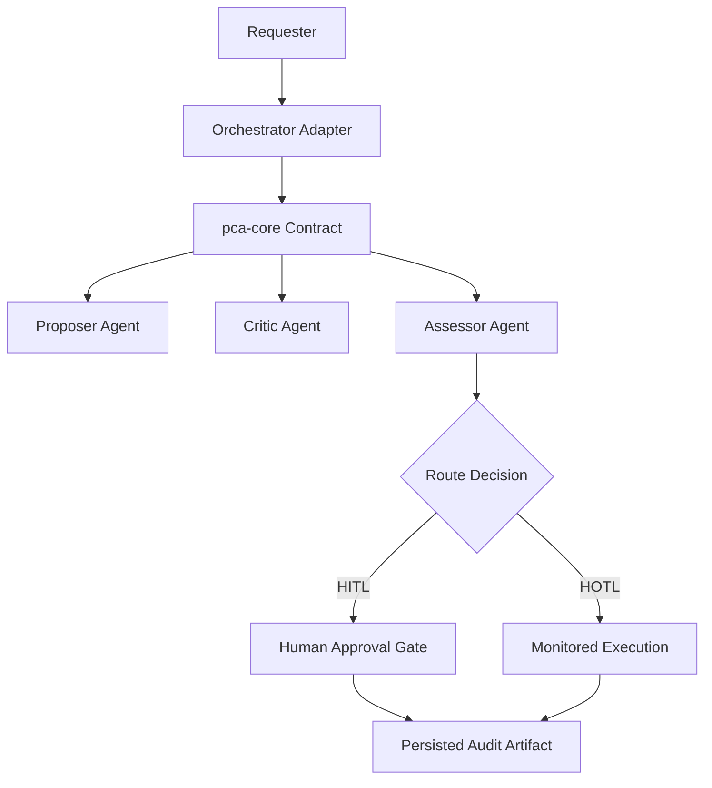

# PCA Workflow and Role Model

This document shows PCA workflow execution with explicit roles and AI agents.

## Role Definitions

- `Requester`: submits decision and context.
- `Orchestrator Agent`: invokes PCA commands, coordinates role outputs, and stores artifacts.
- `Proposer Agent`: produces strongest recommendation with assumptions.
- `Critic Agent`: stress-tests recommendation, risks, and blind spots.
- `Assessor Agent`: issues final verdict and actions.
- `Human Reviewer`: approves or redirects when `HITL` is required.

## Command-to-Role Mapping

| Command | Primary Owner | Supporting Role | Outcome |
|---|---|---|---|
| `pca prepare` | Orchestrator Agent | Requester | session contract + prompts |
| `pca run` | Orchestrator Agent | Requester | compatibility alias of prepare |
| `pca assess` | Assessor Agent | Proposer + Critic | assessment payload |
| `pca route` | Orchestrator Agent | Assessor Agent | governance mode (`HITL`/`HOTL`) |
| `pca persist` | Orchestrator Agent | Human Reviewer (optional) | saved artifact (json/md) |

## Assessment Framework and Scoring

PCA uses weighted criteria on a `0..5` scale and outputs a normalized score band.

Scoring behavior:

- Input via `--scores "criterion=score;criterion=score"`.
- Criteria are weighted from framework definitions.
- Universal criteria contribute `40%` and mode-specific criteria contribute `60%`.
- Output includes `score_summary` with:
    - `weighted_score_5`
    - `weighted_score_100`
    - `band` (`high|medium|low|insufficient-data`)
    - per-criterion score coverage

Example:

```bash
pca assess verify --scores "completeness=4;evidence_quality=3.5;user_impact=4"
```

## Diagram Policy for Cycles > 3

For larger debate loops, workflow diagrams can be user-selected.

- `--diagram-policy auto` (default): include workflow diagram only when `--max-cycles > 3`.
- `--diagram-policy always`: always include diagram.
- `--diagram-policy never`: never include diagram.

Example:

```bash
pca prepare discuss --max-cycles 4 --diagram-policy never
```

## End-to-End Workflow (Role Swimlane)



## Agent Topology (Platform-Agnostic)



## Recommended Agent Responsibilities

- Keep `Orchestrator Agent` stateless and contract-driven.
- Keep `Proposer`, `Critic`, and `Assessor` prompts role-pure.
- Route all high-uncertainty outcomes through `HITL`.
- Persist every final assessment for auditability.

## Integration Notes

- Use `SCHEMA.md` as the single source of truth for JSON field names.
- Adapters in `integrations/` should only map platform I/O to PCA commands.
- Avoid embedding platform-specific logic in `src/pca-core.js`.
